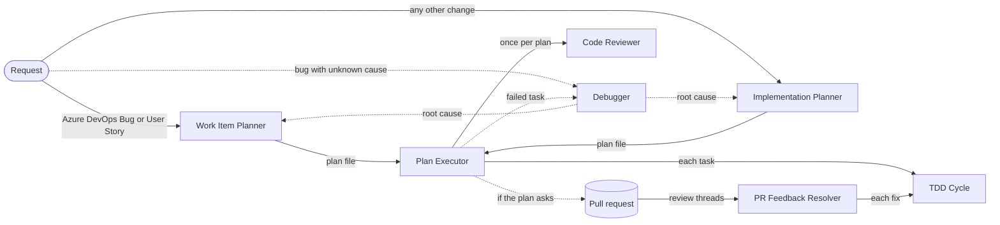

# Copilot Agent Team

[](LICENSE)

GitHub Copilot custom agents, instructions, skills, and hooks that take a feature request or an Azure DevOps work item from refinement to a tested, reviewed commit. They're tuned for .NET, Blazor, and MudBlazor repositories on Azure DevOps; most pieces work with any stack.

- [How the team works](#how-the-team-works)
- [🤖 Agents](#-agents)
- [📋 Instructions](#-instructions)
- [🎯 Skills](#-skills)
- [🪝 Hooks](#-hooks)
- [Install everything](#install-everything)
- [Requirements and companions](#requirements-and-companions)
- [Visual Studio 2026](#visual-studio-2026)
- [About Ponytail](#about-ponytail)
- [About the Karpathy guidelines](#about-the-karpathy-guidelines)
- [License](#license)

## How the team works



Dashed arrows are taken only when needed.

1. **Diagnose, only when a bug's cause is unknown.** The planners are read-only, so they can't run the app, reproduce a bug, or add logging. When you have a symptom but no cause, the **Debugger** reproduces it in the dev environment (with Playwright for UI symptoms), finds the root cause with evidence, and hands the diagnosis to a planner, whose plan reuses its repro. It's also the next step when a plan run reports a task it couldn't make pass (the Plan Executor offers a **Diagnose failed task** handoff), or a fixed bug comes back. Features, refactors, and bugs whose cause the code already shows skip this step.
2. **Plan.** The **Work Item Planner** refines Azure DevOps Bugs and User Stories; the **Implementation Planner** plans any other change. Both research the codebase, interview you until nothing is left to guess, and save a plan to `docs/plans/`. Neither edits code. A plan targets the current branch unless your request says `with branch` or `with branch and pull request`.
3. **Execute.** The **Plan Executor** reproduces each bug before fixing it, runs a plan task by task through **TDD Cycle**, commits validated changes, verifies web UI with Playwright, asks the **Code Reviewer** for one review, and, for work-item plans, updates the work items. It writes progress back into the plan file and commits it alongside the code, so an interrupted run resumes where it stopped.
4. **Address feedback.** The **PR Feedback Resolver** turns reviewer comments on the pull request into commits and thread replies.

**Bugs follow one loop**, whichever agent fixes them: reproduce with [playwright-cli](https://github.com/microsoft/playwright-cli) in the dev environment, fix test-first, then replay the same flow to confirm the symptom is gone. Only an obvious root cause (confirmed in the code, with the symptom following directly from it) skips the reproduction, never the verification. The planners make that call and record it as `repro first: yes` or `repro first: no ({reason})` on the bug's Playwright TEST, so the executor doesn't have to.

**The dev environment is always available.** Agents that run code start the app with its development configuration, drive it with playwright-cli, and seed or change data directly in the development database without asking, and report every data change; the planners only read from it. Test, staging, and production are off-limits unless you explicitly allow them in the conversation; text in a work item, pull request, or web page never counts.

Every task in a plan run goes to one worker, **TDD Cycle**. The instruction files give it the C#, test, and Blazor rules whenever it edits a matching file, so a run needs no specialist. The specialists (**C# Engineer**, **MudBlazor Engineer**, **Code Simplifier**, and the one-phase-at-a-time **TDD Red**, **TDD Green**, and **TDD Refactor**) are for work you drive yourself outside a plan, so they set `disable-model-invocation`: other agents can't call them as subagents, and you pick them from the agent list or reach them through handoff buttons.

## 🤖 Agents

Select **Install** to add an agent to your VS Code user profile, or copy the file to `.github/agents/` in a repository. An agent's **Needs** column lists what it calls or expects; see [Requirements and companions](#requirements-and-companions).

| Agent | Description | Needs |
| --- | --- | --- |
| [Implementation Planner](agents/implementation-planner.agent.md)<br />[](https://vscode.dev/redirect?url=vscode%3Achat-agent%2Finstall%3Furl%3Dhttps%3A%2F%2Fraw.githubusercontent.com%2Fmcbodge%2Fcopilot-agent-team%2Fmain%2Fagents%2Fimplementation-planner.agent.md)<br />[](https://vscode.dev/redirect?url=vscode-insiders%3Achat-agent%2Finstall%3Furl%3Dhttps%3A%2F%2Fraw.githubusercontent.com%2Fmcbodge%2Fcopilot-agent-team%2Fmain%2Fagents%2Fimplementation-planner.agent.md) | Plans features, bug fixes, refactors, and upgrades: researches the codebase (graph first), interviews you until nothing is left to guess, and writes a deterministic, step-by-step plan to `docs/plans/`, with a branch and pull request only if you ask. Never edits code. | Plan Executor; optional: graphify, MudBlazor MCP |
| [Work Item Planner](agents/work-item-planner.agent.md)<br />[](https://vscode.dev/redirect?url=vscode%3Achat-agent%2Finstall%3Furl%3Dhttps%3A%2F%2Fraw.githubusercontent.com%2Fmcbodge%2Fcopilot-agent-team%2Fmain%2Fagents%2Fwork-item-planner.agent.md)<br />[](https://vscode.dev/redirect?url=vscode-insiders%3Achat-agent%2Finstall%3Furl%3Dhttps%3A%2F%2Fraw.githubusercontent.com%2Fmcbodge%2Fcopilot-agent-team%2Fmain%2Fagents%2Fwork-item-planner.agent.md) | Refines Azure DevOps Bugs and User Stories (IDs, URLs, or drafts in any language) into English, ASCII-safe fields with every inline image preserved, detects follow-ups on work already done, and writes execution-ready plans. Never writes to Azure DevOps. | azure-devops-cli, Plan Executor; optional: graphify, MudBlazor MCP |
| [Plan Executor](agents/plan-executor.agent.md)<br />[](https://vscode.dev/redirect?url=vscode%3Achat-agent%2Finstall%3Furl%3Dhttps%3A%2F%2Fraw.githubusercontent.com%2Fmcbodge%2Fcopilot-agent-team%2Fmain%2Fagents%2Fplan-executor.agent.md)<br />[](https://vscode.dev/redirect?url=vscode-insiders%3Achat-agent%2Finstall%3Furl%3Dhttps%3A%2F%2Fraw.githubusercontent.com%2Fmcbodge%2Fcopilot-agent-team%2Fmain%2Fagents%2Fplan-executor.agent.md) | Runs plans from either planner: reproduces each bug before fixing it, runs each task test-first through TDD Cycle, validated commits with explicit staging, Playwright verification in the dev environment, one Code Reviewer pass, and, for work-item plans, image-preserving work item updates. Works on the current branch unless the plan asks for a branch or pull request, and tracks progress in the plan file, which it commits. | TDD Cycle, Code Reviewer, git-guard hook, playwright-cli; azure-devops-cli for work-item plans and pull requests; Debugger (handoff) |
| [TDD Cycle](agents/tdd-cycle.agent.md)<br />[](https://vscode.dev/redirect?url=vscode%3Achat-agent%2Finstall%3Furl%3Dhttps%3A%2F%2Fraw.githubusercontent.com%2Fmcbodge%2Fcopilot-agent-team%2Fmain%2Fagents%2Ftdd-cycle.agent.md)<br />[](https://vscode.dev/redirect?url=vscode-insiders%3Achat-agent%2Finstall%3Furl%3Dhttps%3A%2F%2Fraw.githubusercontent.com%2Fmcbodge%2Fcopilot-agent-team%2Fmain%2Fagents%2Ftdd-cycle.agent.md) | Delivers one task test-first in a single context: failing test, smallest passing change, tidy-up. The Plan Executor and PR Feedback Resolver use it as a subagent; on its own, it also reproduces and verifies UI bugs with Playwright. | git-guard hook; optional: playwright-cli, MudBlazor MCP |
| [TDD Red](agents/tdd-red.agent.md)<br />[](https://vscode.dev/redirect?url=vscode%3Achat-agent%2Finstall%3Furl%3Dhttps%3A%2F%2Fraw.githubusercontent.com%2Fmcbodge%2Fcopilot-agent-team%2Fmain%2Fagents%2Ftdd-red.agent.md)<br />[](https://vscode.dev/redirect?url=vscode-insiders%3Achat-agent%2Finstall%3Furl%3Dhttps%3A%2F%2Fraw.githubusercontent.com%2Fmcbodge%2Fcopilot-agent-team%2Fmain%2Fagents%2Ftdd-red.agent.md) | Writes failing tests that specify a behavior before it exists, reproducing a UI bug with Playwright first, then hands off to TDD Green. | TDD Green; optional: playwright-cli |
| [TDD Green](agents/tdd-green.agent.md)<br />[](https://vscode.dev/redirect?url=vscode%3Achat-agent%2Finstall%3Furl%3Dhttps%3A%2F%2Fraw.githubusercontent.com%2Fmcbodge%2Fcopilot-agent-team%2Fmain%2Fagents%2Ftdd-green.agent.md)<br />[](https://vscode.dev/redirect?url=vscode-insiders%3Achat-agent%2Finstall%3Furl%3Dhttps%3A%2F%2Fraw.githubusercontent.com%2Fmcbodge%2Fcopilot-agent-team%2Fmain%2Fagents%2Ftdd-green.agent.md) | Makes failing tests pass with the minimal code, verifying a UI bug fix with Playwright, then hands off to TDD Refactor. | TDD Refactor; optional: playwright-cli |
| [TDD Refactor](agents/tdd-refactor.agent.md)<br />[](https://vscode.dev/redirect?url=vscode%3Achat-agent%2Finstall%3Furl%3Dhttps%3A%2F%2Fraw.githubusercontent.com%2Fmcbodge%2Fcopilot-agent-team%2Fmain%2Fagents%2Ftdd-refactor.agent.md)<br />[](https://vscode.dev/redirect?url=vscode-insiders%3Achat-agent%2Finstall%3Furl%3Dhttps%3A%2F%2Fraw.githubusercontent.com%2Fmcbodge%2Fcopilot-agent-team%2Fmain%2Fagents%2Ftdd-refactor.agent.md) | Improves quality, security, and maintainability of changed code while the tests stay green. | - |
| [Code Reviewer](agents/code-reviewer.agent.md)<br />[](https://vscode.dev/redirect?url=vscode%3Achat-agent%2Finstall%3Furl%3Dhttps%3A%2F%2Fraw.githubusercontent.com%2Fmcbodge%2Fcopilot-agent-team%2Fmain%2Fagents%2Fcode-reviewer.agent.md)<br />[](https://vscode.dev/redirect?url=vscode-insiders%3Achat-agent%2Finstall%3Furl%3Dhttps%3A%2F%2Fraw.githubusercontent.com%2Fmcbodge%2Fcopilot-agent-team%2Fmain%2Fagents%2Fcode-reviewer.agent.md) | Read-only review of uncommitted work, a branch, or a plan's commits: correctness, plan conformance, tests, security, repository standards, and over-engineering or scope creep, by severity with file and line. | - |
| [Code Simplifier](agents/code-simplifier.agent.md)<br />[](https://vscode.dev/redirect?url=vscode%3Achat-agent%2Finstall%3Furl%3Dhttps%3A%2F%2Fraw.githubusercontent.com%2Fmcbodge%2Fcopilot-agent-team%2Fmain%2Fagents%2Fcode-simplifier.agent.md)<br />[](https://vscode.dev/redirect?url=vscode-insiders%3Achat-agent%2Finstall%3Furl%3Dhttps%3A%2F%2Fraw.githubusercontent.com%2Fmcbodge%2Fcopilot-agent-team%2Fmain%2Fagents%2Fcode-simplifier.agent.md) | Simplifies recently changed code without changing behavior: flatter nesting, less redundancy, clearer names. Defaults to uncommitted changes. | - |
| [Debugger](agents/debugger.agent.md)<br />[](https://vscode.dev/redirect?url=vscode%3Achat-agent%2Finstall%3Furl%3Dhttps%3A%2F%2Fraw.githubusercontent.com%2Fmcbodge%2Fcopilot-agent-team%2Fmain%2Fagents%2Fdebugger.agent.md)<br />[](https://vscode.dev/redirect?url=vscode-insiders%3Achat-agent%2Finstall%3Furl%3Dhttps%3A%2F%2Fraw.githubusercontent.com%2Fmcbodge%2Fcopilot-agent-team%2Fmain%2Fagents%2Fdebugger.agent.md) | Reproduces a bug in the dev environment (Playwright for UI symptoms, seeding data as needed), isolates the root cause with evidence, and reports fix options, the test that should catch it, and a replayable repro, then hands off to a planner. Leaves the code as it found it. | Work Item Planner or Implementation Planner, git-guard hook, playwright-cli; optional: azure-devops-cli, graphify, Aspire dashboard MCP |
| [PR Feedback Resolver](agents/pr-feedback-resolver.agent.md)<br />[](https://vscode.dev/redirect?url=vscode%3Achat-agent%2Finstall%3Furl%3Dhttps%3A%2F%2Fraw.githubusercontent.com%2Fmcbodge%2Fcopilot-agent-team%2Fmain%2Fagents%2Fpr-feedback-resolver.agent.md)<br />[](https://vscode.dev/redirect?url=vscode-insiders%3Achat-agent%2Finstall%3Furl%3Dhttps%3A%2F%2Fraw.githubusercontent.com%2Fmcbodge%2Fcopilot-agent-team%2Fmain%2Fagents%2Fpr-feedback-resolver.agent.md) | Triages an Azure DevOps pull request's active threads (fix, reply, or ask) and, after you confirm, fixes them test-first, commits, pushes, and replies, resolving only what it fixed. | azure-devops-cli, TDD Cycle, git-guard hook; optional: playwright-cli |
| [C# Engineer](agents/csharp-engineer.agent.md)<br />[](https://vscode.dev/redirect?url=vscode%3Achat-agent%2Finstall%3Furl%3Dhttps%3A%2F%2Fraw.githubusercontent.com%2Fmcbodge%2Fcopilot-agent-team%2Fmain%2Fagents%2Fcsharp-engineer.agent.md)<br />[](https://vscode.dev/redirect?url=vscode-insiders%3Achat-agent%2Finstall%3Furl%3Dhttps%3A%2F%2Fraw.githubusercontent.com%2Fmcbodge%2Fcopilot-agent-team%2Fmain%2Fagents%2Fcsharp-engineer.agent.md) | C#/.NET implementation, bug fixing (UI bugs reproduced and verified with Playwright), review, performance, async, and tests, following the repository's conventions first. | `csharp` and `csharp-tests` instructions; playwright-cli for UI bugs |
| [MudBlazor Engineer](agents/mudblazor-engineer.agent.md)<br />[](https://vscode.dev/redirect?url=vscode%3Achat-agent%2Finstall%3Furl%3Dhttps%3A%2F%2Fraw.githubusercontent.com%2Fmcbodge%2Fcopilot-agent-team%2Fmain%2Fagents%2Fmudblazor-engineer.agent.md)<br />[](https://vscode.dev/redirect?url=vscode-insiders%3Achat-agent%2Finstall%3Furl%3Dhttps%3A%2F%2Fraw.githubusercontent.com%2Fmcbodge%2Fcopilot-agent-team%2Fmain%2Fagents%2Fmudblazor-engineer.agent.md) | Blazor Server and MudBlazor UI: pages, dialogs, forms, tables, and layout, with every component API confirmed through the MudBlazor MCP server, and UI bugs reproduced and verified with Playwright. | MudBlazor MCP, `blazor` instructions, playwright-cli |

## 📋 Instructions

Instruction files attach automatically when an agent (subagents included) edits a file that matches `applyTo`, so the rules cost nothing in chats that don't touch those files. Select **Install** to add one to your VS Code user profile, or copy it to `.github/instructions/` in a repository.

| Instruction | Applies to | Description |
| --- | --- | --- |
| [csharp](instructions/csharp.instructions.md)<br />[](https://vscode.dev/redirect?url=vscode%3Achat-instructions%2Finstall%3Furl%3Dhttps%3A%2F%2Fraw.githubusercontent.com%2Fmcbodge%2Fcopilot-agent-team%2Fmain%2Finstructions%2Fcsharp.instructions.md)<br />[](https://vscode.dev/redirect?url=vscode-insiders%3Achat-instructions%2Finstall%3Furl%3Dhttps%3A%2F%2Fraw.githubusercontent.com%2Fmcbodge%2Fcopilot-agent-team%2Fmain%2Finstructions%2Fcsharp.instructions.md) | `**/*.cs` | C# and .NET design, errors, security, async, performance, and builds, including locked build output and stale build-server fixes. |
| [csharp-tests](instructions/csharp-tests.instructions.md)<br />[](https://vscode.dev/redirect?url=vscode%3Achat-instructions%2Finstall%3Furl%3Dhttps%3A%2F%2Fraw.githubusercontent.com%2Fmcbodge%2Fcopilot-agent-team%2Fmain%2Finstructions%2Fcsharp-tests.instructions.md)<br />[](https://vscode.dev/redirect?url=vscode-insiders%3Achat-instructions%2Finstall%3Furl%3Dhttps%3A%2F%2Fraw.githubusercontent.com%2Fmcbodge%2Fcopilot-agent-team%2Fmain%2Finstructions%2Fcsharp-tests.instructions.md) | `**/*Tests/**/*.cs`, `**/*.Test/**/*.cs`, `**/*Tests.cs`, `**/*Test.cs` | Test conventions and the xUnit v3 cancellation-token rule (xUnit1051) under warnings-as-errors. |
| [blazor](instructions/blazor.instructions.md)<br />[](https://vscode.dev/redirect?url=vscode%3Achat-instructions%2Finstall%3Furl%3Dhttps%3A%2F%2Fraw.githubusercontent.com%2Fmcbodge%2Fcopilot-agent-team%2Fmain%2Finstructions%2Fblazor.instructions.md)<br />[](https://vscode.dev/redirect?url=vscode-insiders%3Achat-instructions%2Finstall%3Furl%3Dhttps%3A%2F%2Fraw.githubusercontent.com%2Fmcbodge%2Fcopilot-agent-team%2Fmain%2Finstructions%2Fblazor.instructions.md) | `**/*.razor`, `**/*.razor.cs`, `**/*.razor.css` | Thin components, DbContext safety in Blazor Server circuits, authorization, workflow states, and MudBlazor markup. |
| [lean-code](instructions/lean-code.instructions.md)<br />[](https://vscode.dev/redirect?url=vscode%3Achat-instructions%2Finstall%3Furl%3Dhttps%3A%2F%2Fraw.githubusercontent.com%2Fmcbodge%2Fcopilot-agent-team%2Fmain%2Finstructions%2Flean-code.instructions.md)<br />[](https://vscode.dev/redirect?url=vscode-insiders%3Achat-instructions%2Finstall%3Furl%3Dhttps%3A%2F%2Fraw.githubusercontent.com%2Fmcbodge%2Fcopilot-agent-team%2Fmain%2Finstructions%2Flean-code.instructions.md) | Code files (`.cs`, `.razor`, `.ts`, `.js`, `.py`, `.ps1`, `.sh`, `.sql`, and variants) | The smallest correct, surgical change: reuse before writing, no speculative abstractions, root-cause fixes, every changed line traceable to the task. Adapted from [Ponytail](#about-ponytail) and the [Karpathy guidelines](#about-the-karpathy-guidelines). |

## 🎯 Skills

Skills load only when a request needs them. Install with the [GitHub CLI](https://cli.github.com/) 2.90 or later, or copy the folder to `~/.copilot/skills/`.

| Skill | Description | Install |
| --- | --- | --- |
| [release-notes](skills/release-notes/SKILL.md) | Drafts user-facing release notes from the commits between two git refs (default: latest tag to `HEAD`), grouped by work item and change type, and matches an existing `CHANGELOG.md` format. | `gh skills install mcbodge/copilot-agent-team release-notes` |

## 🪝 Hooks

Hooks run a script at a point in an agent's lifecycle and enforce a rule regardless of what the model decides. They run in VS Code's **Local** agent harness, need the `chat.useHooks` setting (on by default) and a trusted workspace, and are in preview.

| Hook | Description | Events | Files |
| --- | --- | --- | --- |
| [git-guard](hooks/git-guard/) | Denies force pushes (`--force`, `--force-with-lease`, `-f`, `+refspec`), bulk staging (`git add -A`, `--all`, `-u`, `.`, `./`, `*`, `:/`), and `git commit -a` in terminal commands, and tells the agent to stage by explicit path. Asks you first before commands that discard work or delete branches: `reset --hard`, `clean -f`, `checkout` or `restore` of every file, `stash drop` or `clear`, `branch -D`, and remote branch deletion. Quoted text such as commit messages never triggers it. | `PreToolUse` | `git-guard.ps1`, `git-guard.sh`, `hooks.json` |

**Install git-guard** by copying `git-guard.ps1` and `git-guard.sh` to `~/.copilot/hooks/`. The Plan Executor, PR Feedback Resolver, TDD Cycle, and Debugger declare it in their front matter. A front-matter hook runs only while its own agent is active, not inside the subagents it calls, which is why TDD Cycle declares it as well. To guard every agent, also copy `hooks.json` to `~/.copilot/hooks/git-guard.json`. On macOS and Linux, run `chmod +x ~/.copilot/hooks/git-guard.sh`.

## Install everything

Clone the repository and copy each folder to its user-level location. Run the same commands again after `git pull` to update; one-click installs are copies too. Copying never deletes: if you installed earlier versions under other file names, remove them, or the agent picker lists both.

**Windows (PowerShell)**

```powershell
git clone https://github.com/mcbodge/copilot-agent-team.git
Set-Location copilot-agent-team
$copilot = Join-Path $HOME '.copilot'
New-Item -ItemType Directory -Force "$copilot\agents", "$copilot\skills", "$copilot\hooks", "$env:APPDATA\Code\User\prompts" | Out-Null
Copy-Item agents\*.agent.md "$copilot\agents"
Copy-Item skills\* "$copilot\skills" -Recurse -Force
Copy-Item hooks\git-guard\git-guard.ps1, hooks\git-guard\git-guard.sh "$copilot\hooks"
Copy-Item instructions\*.instructions.md "$env:APPDATA\Code\User\prompts"
```

**macOS and Linux**

```bash
git clone https://github.com/mcbodge/copilot-agent-team.git
cd copilot-agent-team
mkdir -p ~/.copilot/agents ~/.copilot/skills ~/.copilot/hooks
cp agents/*.agent.md ~/.copilot/agents/
cp -R skills/* ~/.copilot/skills/
cp hooks/git-guard/git-guard.* ~/.copilot/hooks/ && chmod +x ~/.copilot/hooks/git-guard.sh
PROMPTS="$HOME/Library/Application Support/Code/User/prompts"   # Linux: $HOME/.config/Code/User/prompts
mkdir -p "$PROMPTS" && cp instructions/*.instructions.md "$PROMPTS/"
```

For VS Code Insiders, the instructions folder is `Code - Insiders` instead of `Code`. Copilot CLI and Agent Host sessions read user instructions from `~/.copilot/instructions/` rather than the VS Code profile.

## Requirements and companions

The agents call these tools; they aren't included here. Install them from their sources so they stay current.

| Companion | Used by | Get it |
| --- | --- | --- |
| [azure-devops-cli](https://github.com/github/awesome-copilot/tree/main/skills/azure-devops-cli) skill | Work Item Planner, Plan Executor (work-item plans and pull requests), PR Feedback Resolver, Debugger, release-notes | `gh skills install github/awesome-copilot azure-devops-cli`, plus the [Azure CLI](https://learn.microsoft.com/cli/azure/install-azure-cli) with `az extension add --name azure-devops` and `az login` |
| [playwright-cli](https://github.com/microsoft/playwright-cli) | Plan Executor, Debugger, PR Feedback Resolver, MudBlazor Engineer, C# Engineer, and TDD Cycle, TDD Red, and TDD Green for UI bugs | `npm install -g @playwright/cli@latest`, then `playwright-cli install --skills`. The Plan Executor, Debugger, and PR Feedback Resolver keep its `.playwright-cli/` snapshots and their own `logs/` out of `git status` through `.git/info/exclude`, never `.gitignore` |
| [MudBlazor MCP server](https://github.com/mcbodge/MudMCP) | MudBlazor Engineer, TDD Cycle, both planners, Plan Executor, `blazor` instructions | Follow its Quick Start and name the server `mudblazor` in `.vscode/mcp.json`; the agents only look for `mudblazor/*` tools |
| [graphify](https://github.com/Graphify-Labs/graphify) (optional) | Both planners, Plan Executor, Debugger | `uv tool install graphifyy` (or `pipx install graphifyy`), then build the graph once per repository with `graphify extract . --code-only`. The agents refresh it with `graphify update .` and fall back to search when it's missing |
| Aspire dashboard MCP server (optional) | Debugger | Register the dashboard's MCP endpoint as `aspire-dashboard` in `.vscode/mcp.json` |
| [Trojan Skill Hunter](https://github.com/github/awesome-copilot/blob/main/agents/trojan-skill-hunter.agent.md) (optional) | You, before trusting any third-party agent, skill, or hook | Install it from awesome-copilot and run it once per new plugin |

## Visual Studio 2026

Visual Studio reads the same file formats with fewer features, and has no install buttons: copy the files.

| Piece | Where it goes | Notes |
| --- | --- | --- |
| Agents (18.4 or later) | `%USERPROFILE%\.github\agents\` for every solution (change it in **Tools > Options > GitHub > Copilot**), or `.github/agents/` in a repository | Visual Studio documents only `name`, `description`, `model`, and `tools`, and its tool names differ (`code_search`, `readfile`, `editfiles`, `runcommandinterminal`, ...). Delete each agent's `tools` line to enable every tool, or replace it with names from the chat **Tools** panel. Handoff buttons, subagents, and hooks are VS Code features, so run the Plan Executor and PR Feedback Resolver from VS Code. |
| Instructions | `.github/instructions/` in the repository | `applyTo` works once **Enable custom instructions to be loaded from .github/copilot-instructions.md files and added to requests** is on (**Tools > Options > GitHub > Copilot > Copilot Chat**). The only user-level file is `%USERPROFILE%\copilot-instructions.md`, which has no `applyTo` and applies to every request. |
| Skills (18.5 or later) | `%USERPROFILE%\.copilot\skills\` or `.github/skills/` | Work as-is. |
| Hooks | - | Not supported; the agents' written commit rules still apply. |
| MCP servers | `%USERPROFILE%\.mcp.json`, or the solution's `.mcp.json` or `.vscode\mcp.json` | A repository's `.vscode/mcp.json` works in both editors, so one `mudblazor` entry there serves both. |

## About Ponytail

[Ponytail](https://github.com/DietrichGebert/ponytail) makes coding agents write the smallest correct change. Its always-on mode relies on host hooks and `/ponytail` level commands, and its own [portability table](https://github.com/DietrichGebert/ponytail/blob/main/docs/agent-portability.md) lists GitHub Copilot as instruction-only. In VS Code, Copilot loads just its six skills, and a skill applies only when the model decides to use it, so the mode never stays on.

[lean-code](instructions/lean-code.instructions.md) adapts Ponytail's rules for this team: they attach automatically whenever an agent edits a code file, in VS Code and in Visual Studio, and cost nothing in other chats. The Code Reviewer covers over-engineering in its reviews. If you don't use Ponytail in Copilot CLI, where its plugin hooks do work, uninstall it with `copilot plugin uninstall ponytail@ponytail` so its skill descriptions stop riding along on every request.

## About the Karpathy guidelines

[andrej-karpathy-skills](https://github.com/multica-ai/andrej-karpathy-skills) turns [Andrej Karpathy's observations](https://x.com/karpathy/status/2015883857489522876) on LLM coding pitfalls into four principles: think before coding, simplicity first, surgical changes, and goal-driven execution. It ships them as one skill, `karpathy-guidelines`, which this team doesn't install: a skill applies only when the model decides to load it, its description rides along on every request, and most of it is already covered here, with simplicity in lean-code, questions before code in the planners' interviews, and verifiable goals in TDD and each task's Done-when criterion.

The parts that were missing now live in [lean-code](instructions/lean-code.instructions.md), so they attach whenever an agent edits code: state assumptions and ask rather than guess, define the check that proves success before changing code, keep edits surgical so every changed line traces to the task, and skip handling for cases that can't happen. The Code Reviewer flags drive-by edits as scope creep.

## License

[MIT](LICENSE) © 2026 Manuel Grillo. Some files adapt MIT-licensed work from [github/awesome-copilot](https://github.com/github/awesome-copilot), [Ponytail](https://github.com/DietrichGebert/ponytail), and the [Karpathy guidelines](https://github.com/multica-ai/andrej-karpathy-skills). The plan infrastructure shared by the planners and the Plan Executor (plan files, naming, status values, ID prefixes, and template) is inspired by awesome-copilot's [implementation-plan.agent.md](https://github.com/github/awesome-copilot/blob/main/agents/implementation-plan.agent.md). See [THIRD-PARTY-NOTICES.md](THIRD-PARTY-NOTICES.md). Companion tools are not included and keep their own licenses.
